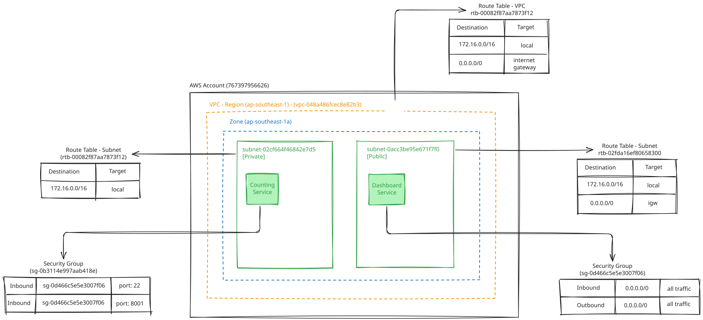

# Counting and Dashboard Service Infrastructure

Terraform configuration for provisioning the AWS infrastructure used by a
private **Counting Service** and a public **Dashboard Service**.

## Architecture



The configuration creates:

- A VPC with separate subnets for the counting and dashboard services.
- A public dashboard EC2 instance with an Elastic IP and internet gateway
  access.
- A private counting-service EC2 instance without a public IP.
- Security groups that allow the dashboard service to reach the counting
  service over SSH and port `8001`.
- An automatically generated ED25519 SSH key pair.

## Prerequisites

- Terraform `>= 1.12`
- AWS provider `>= 6.0.0`
- AWS credentials configured for the `master-programmatic-admin-role` profile
- An AWS region with access to Ubuntu 24.04 AMD64 AMIs

## Usage

Review or override the defaults in `variables.tfvars`, then run:

```bash
terraform init
terraform plan -var-file=variables.tfvars
terraform apply -var-file=variables.tfvars
```

After applying, Terraform outputs the dashboard public IP and URL:

```bash
terraform output dashboard_public_ip
terraform output dashboard_url
```

To remove the infrastructure, run:

```bash
terraform destroy -var-file=variables.tfvars
```

The Elastic IP is protected from destruction by default with
`prevent_destroy = true`; remove or change that lifecycle setting before a
full teardown if the address should be released.
